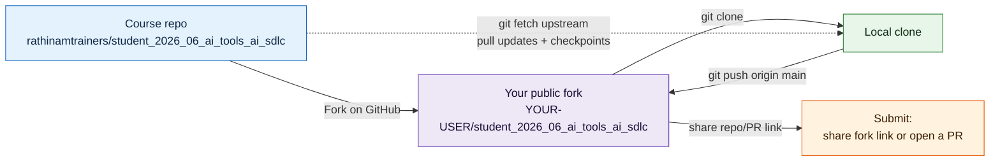

# LearnFlow — Mastering AI Tools (AI SDLC) · Course Project Repo

> The shared project repository for the **Mastering AI Tools (AI SDLC)** programme — June 2026 cohort.
> You will build one real application, **LearnFlow** (a Learning Management System), across the
> **nine SDLC phases** and **four AI tool ecosystems**, one feature at a time, over 16 weeks.

**Audience:** enrolled students — working developers with basic Python or JavaScript, comfortable with Git and the command line. No prior AI-tool experience assumed.

**Live sessions:** every **Saturday, 8:00–10:00 PM IST** (2 hours, recorded) on Microsoft Teams. You practise *after* each session from the recording plus the written lab guide.

---

## What's in this repo

| Path | What it is | Available from |
|---|---|---|
| `labs/week-NN/` | Your weekly lab deliverables (starter templates provided) | Now |
| `checkpoint/week-NN` *(branches)* | Known-good snapshots of LearnFlow after each week — your safety net | Rolling, per week |
| `backend/`, `frontend/`, `docker-compose.yml` | The **LearnFlow** application itself | **Session 2** |

> **Heads-up:** Week 1 builds the *map*, not the app. The LearnFlow application code (FastAPI + React + Postgres) lands at the repo root in **Session 2**. This week you only need to fork this repo and complete Lab 1 under `labs/week-01/`.

---

## How you work in this course: fork + shared link

You **do not** push to this repository directly. You **fork** it once, do all your work in **your own public fork**, and submit each weekly lab by sharing a link. Forks of a public repo are public, which is what makes the open-source free tiers (CodeRabbit, Semgrep, GitHub Advanced Security, …) work later.



<details>
<summary>ASCII fallback — fork & submit flow</summary>

```
Course repo  --(Fork on GitHub)-->  Your public fork  --(git clone)-->  Local clone
   ^                                       ^                                  |
   |                                       |   git push origin main           |
   |                                       +----------------------------------+
   |
   +--(git fetch upstream: updates + checkpoint branches)--> Local clone

Submit: share your fork's labs/week-NN/ link  OR  open a Pull Request -> copy URL
```

</details>

### One-time setup

```bash
# 1. Fork this repo on GitHub (button, top-right) — keep the fork PUBLIC.
# 2. Clone YOUR fork (replace YOUR-USERNAME):
git clone https://github.com/YOUR-USERNAME/student_2026_06_ai_tools_ai_sdlc.git
cd student_2026_06_ai_tools_ai_sdlc

# 3. Add the course repo as 'upstream' so you can pull updates + checkpoint branches:
git remote add upstream https://github.com/rathinamtrainers/student_2026_06_ai_tools_ai_sdlc.git
git fetch upstream

# 4. Confirm:
git remote -v   # 'origin' = your fork, 'upstream' = the course repo
```

---

## Weekly labs

Each week has a folder under `labs/`. Do your work there, commit it to your fork, and submit the link.

```
labs/
  week-01/                # Lab 1 — Tool Atlas & Accounts (this week)
    README.md             # what to produce + how to submit
    tool-atlas.md         # fill in: 9 SDLC phases x 4 ecosystems
    classification.md     # fill in: classify 6 tools
    quiz.md               # self-quiz 1 answers
    accounts/             # screenshots proving you're signed in
```

Submit each week by sharing **either**:

- a link to your **public fork** at the `labs/week-NN/` folder, **or**
- a **Pull Request** from your fork's branch back to this course repo (copy the PR URL).

Weekly lab sign-offs + the Week-16 capstone earn your certificate.

---

## Checkpoint branches (your safety net)

This repo ships `checkpoint/week-NN` branches — each a **known-good snapshot** of LearnFlow after that week's feature. Fall behind or break something? Reset to a clean baseline and keep pace:

```bash
git fetch upstream
git checkout -b my-week-05 upstream/checkpoint/week-05
```

You never need a checkpoint for Lab 1 — it's here so you're never stuck waiting on last week's work to start this week's.

---

## The LearnFlow stack (from Session 2)

Fixed platform you run; AI generates the rest:

- **Backend:** Python 3.13 · FastAPI · SQLAlchemy/SQLModel · JWT auth
- **Frontend:** React 19 · TypeScript · Tailwind CSS 4
- **Data:** PostgreSQL 17
- **Ops:** Docker · GitHub Actions · hosting on Render/Fly.io
- **Tests:** pytest · Playwright

---

## Cost & posture

Everything in this course runs on **free tiers**, and labs use **public repos** on purpose so the open-source free tiers apply. No credit card is required for the tools you must have. Free-tier limits change — if a vendor removes a free tier, the programme substitutes an alternative.

## Contact

Rathinam Trainers & Consultants · <https://www.rathinamtrainers.com> · rajan@rathinamtrainers.com
